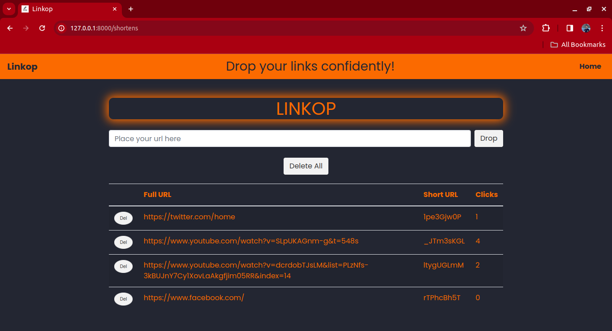

# Linkop

Linkop is a URL shortener web application designed to simplify the process of shortening long URLs into manageable and easy-to-share links.

## Features

- **URL Shortening:** Convert long URLs into shorter, more manageable links.
- **Tracking Clicks:** Know the number of times you visited each link.
- **Links Management:** Easily delete unwanted links either all at once or one at a time.

## Screenshots

## Technologies 
- **Nodejs:** as the main runtime environment.
- **Typescript:** as the programming language.
- **Express:** as the server-side framework.
- **mongoDB:** as the database.
- **ejs:** as the template engine for the UI.
- **docker:**: for containerizing the application.

## Installation

### Prerequisites

- Docker installed

### Steps

1. Clone the repository: `git clone https://github.com/baarayy/linkop.git`
2. Navigate to the project directory: `cd linkop`
3. Add your environment variables
4. Start the application: `docker-compose up --build`

## Contributing

Contributions are welcome! If you'd like to contribute to Linkop, please follow these steps:

1. Fork the repository.
2. Create your branch: `git checkout -b feature/NewFeature`.
3. Commit your changes: `git commit -am 'Add a new feature'`.
4. Push to the branch: `git push origin feature/NewFeature`.
5. Submit a pull request.

## License

This project is licensed under the [MIT License](LICENSE).
